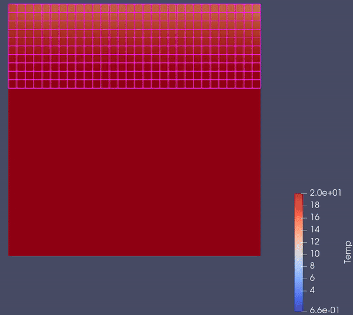
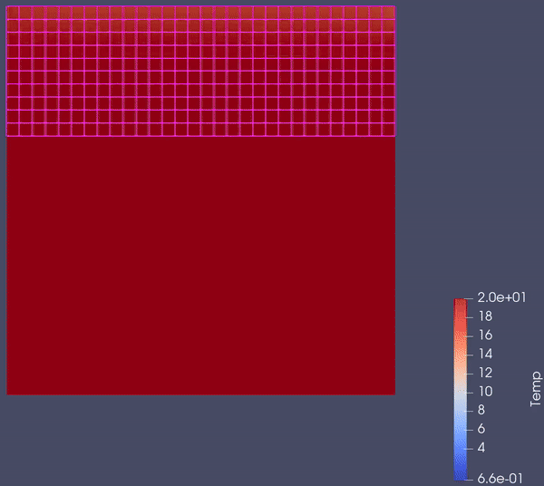

# Heat Flow Simulation Through a Building Wall

- With a styrofoam insulating layer:

- Insulating layer replaced with an additional brick layer:

>Project <a href="https://github.com/przemek890/MES/blob/master/data/Mes_spr/Janiszewski_Przemys%C5%82aw_grupa_02_Sprawozdanie_MES.pdf">Documentation</a> in Polish