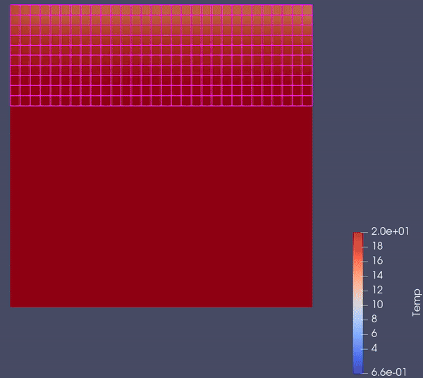
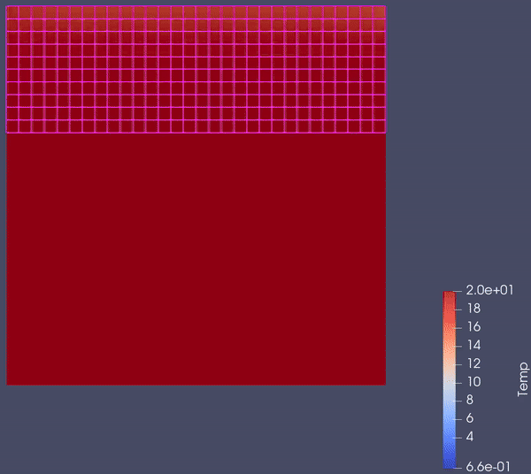

# Heat Flow Simulation Through a Building Wall

- With a styrofoam insulating layer:


- Insulating layer replaced with an additional brick layer:


---

## How to Run

1. Install dependencies:
```bash
pip install -r requirements.txt
```

2. Run the simulation:
```bash
python main.py
```

---

>Project <a href="https://github.com/przemek890/MES/blob/master/data/Mes_spr/Janiszewski_Przemys%C5%82aw_grupa_02_Sprawozdanie_MES.pdf">Documentation</a> in Polish

> Construction data:
> <a href="https://www.certyfikat-energetyczny.powiat.pl/CE_P/wspolczynniki_przewodzenia.html">source_1</a>
> <a href="http://if.pk.edu.pl/tabele/wPrzejC.htm">source_2</a>